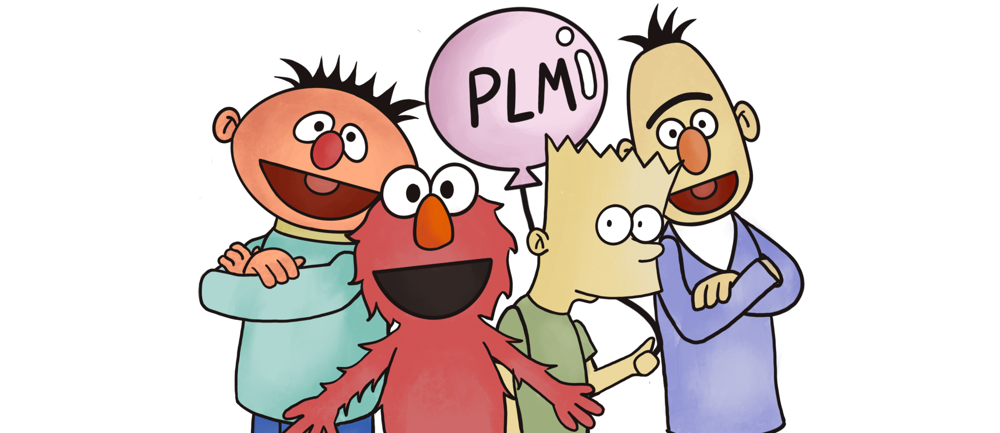

# Pre-train, Prompt, Predict
> Feel free to let us know our missed papers (```issue``` or ```pull request```)

[**Typology**](https://github.com/pfliu-nlp/NLPedia-Pretrain/blob/main/README.md#typology-of-prompting-methods) | 
[**Prompt Paper**](https://github.com/neulab/ExplainaBoard#web-based-toolkit-quick-learning) |
[**Pretrained LM Family**](#api-based-toolkit-quick-installation) |
[**Survey**](https://arxiv.org/pdf/2107.13586.pdf) |
[**Website**](http://pretrain.nlpedia.ai/) |
[**Copyright**](https://github.com/pfliu-nlp/NLPedia-Pretrain/blob/main/README.md#copyright-and-acknowledgement)


 
  
 
 


 
## Typology of Prompting Methods


* ### Pre-trained Models ([Detailed Description](http://pretrain.nlpedia.ai/data/pdf/plm.pdf))
  * *Left-to-right Language Model*: [\[1\]]() [\[2\]]()
  * *Masked Language Model*: [\[1\]]() [\[2\]]()
  * *Prefix Language Model*: [\[1\]]() [\[2\]]()
  * *Encoder-Decoder*: [\[1\]]() [\[2\]]()
* ### Prompt Engineering ([Detailed Description](http://pretrain.nlpedia.ai/data/pdf/template.pdf))
  * *Shape*
    * *Cloze prompt*: [\[1\]]() [\[2\]]()
    * *Prefix prompt*: [\[1\]]() [\[2\]]()
  * *Human Effort*
    * *Hand-crated*
    * *Automated*
        - *Discrete*: [\[1\]]() [\[2\]]()
        - *Continuous*: [\[1\]]() [\[2\]]()
* ### Answer Engineering ([Detailed Description](http://pretrain.nlpedia.ai/data/pdf/answer.pdf))
  * *Shape*
    * *Token*: [\[1\]]() [\[2\]]()
    * *Span*: [\[1\]]() [\[2\]]()
    * *Sentence*: [\[1\]]() [\[2\]]()
  * Human Effort
    * *Hand-crated*: [\[1\]]() [\[2\]]()
    * *Automated*
        - *Discrete*: [\[1\]]() [\[2\]]()
        - *Continuous*: [\[1\]]() [\[2\]]()
    
* ### Multi-Prompt Learning ([Detailed Description](http://pretrain.nlpedia.ai/data/pdf/multi-prompt.pdf))
  * *Prompt Ensemble*: [\[1\]]() [\[2\]]()
  * *Prompt Augmentation*: [\[1\]]() [\[2\]]()
  * *Prompt Composition*: [\[1\]]() [\[2\]]()
  * *Prompt Decomposition*: [\[1\]]() [\[2\]]()
  * *Prompt Sharing*: [\[1\]]() [\[2\]]()
    
* ### Prompt-based Training Strategies ([Detailed Description](http://pretrain.nlpedia.ai/data/pdf/learning.pdf))
  * Parameter Updating
    * *Promptless Fine-tuning*: [\[1\]]() [\[2\]]()
    * *Tuning-free Prompting*: [\[1\]]() [\[2\]]()
    * *Fixed-LM Prompt Tuning*: [\[1\]]() [\[2\]]()
    * *Fixed-prompt LM Tuning*: [\[1\]]() [\[2\]]()
    * *Prompt+LM Tuning*: [\[1\]]() [\[2\]]()
  * Training Sample Size
    * *Zero-shot*: [\[1\]]() [\[2\]]()
    * *Few-shot*: [\[1\]]() [\[2\]]()
    * *Full-data*: [\[1\]]() [\[2\]]()
    
 
## Copyright and Acknowledgement
* If you aim to use picture from our github repo or survey, please state the source of these pictures.
* These pictures are drawn by Weizhe and co-designed by Pengfei.